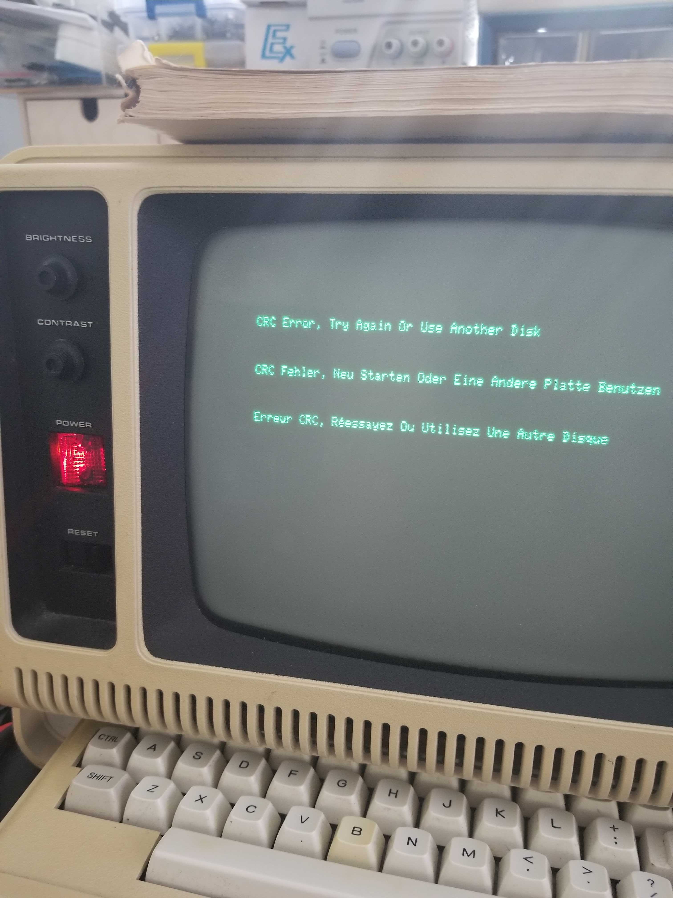

# TRS80-Twilio

Calling the Twilio SMS API from a TRS-80 Model 100.


## Background
The original goal of this project was to receive data from my TRS-80 Model 4P's RS232 interface and send a text message with the Twilio SMS API from an ESP8266.

There were two basic ways to communicate via RS232:
1. Write everything in Z80 assembly, assemble it, load into memory, and invoke.
2. Embed Z80 assembly as machine language into BASIC and invoke with ```USR0``` (see [TRS80-4P/Z80.BAS](TRS80-4P/Z80.BAS)).

As soon as I started actually making some ground one night I went to sleep.
The next morning I woke up horrified when I tried to boot up the model 4P.



Somehow it either had faulty RAM segment or my preboot floppy corrupted.
Either way, this project idea was killed just like that; I didn't have any time left to try repairing.


Luckily I just recently bought a TRS-80 Model 100 off eBay for $50.
Its not nearly as cool looking as the TRS-80 Model 4P, but it is what it is.


## Embedded Development in VS Code
I decided I would take this opportunity to learn about a new tool, [PlatformIO](https://platformio.org/).

[PlatformIO IDE Extension](https://marketplace.visualstudio.com/items?itemName=platformio.platformio-ide)

Linux Additional Steps:
* https://docs.platformio.org/en/latest/faq.html#platformio-udev-rules
* Setting permissions to allow board upload:
  * ```sudo usermod -a -G dialout <user>```
  * ```sudo usermod -a -G plugdev <user>```
  * ```sudo usermod -a -G tty <user>```
* Logout/Login


## References
* [Introduction to PlatformIO](https://www.youtube.com/watch?v=0poh_2rBq7E)
