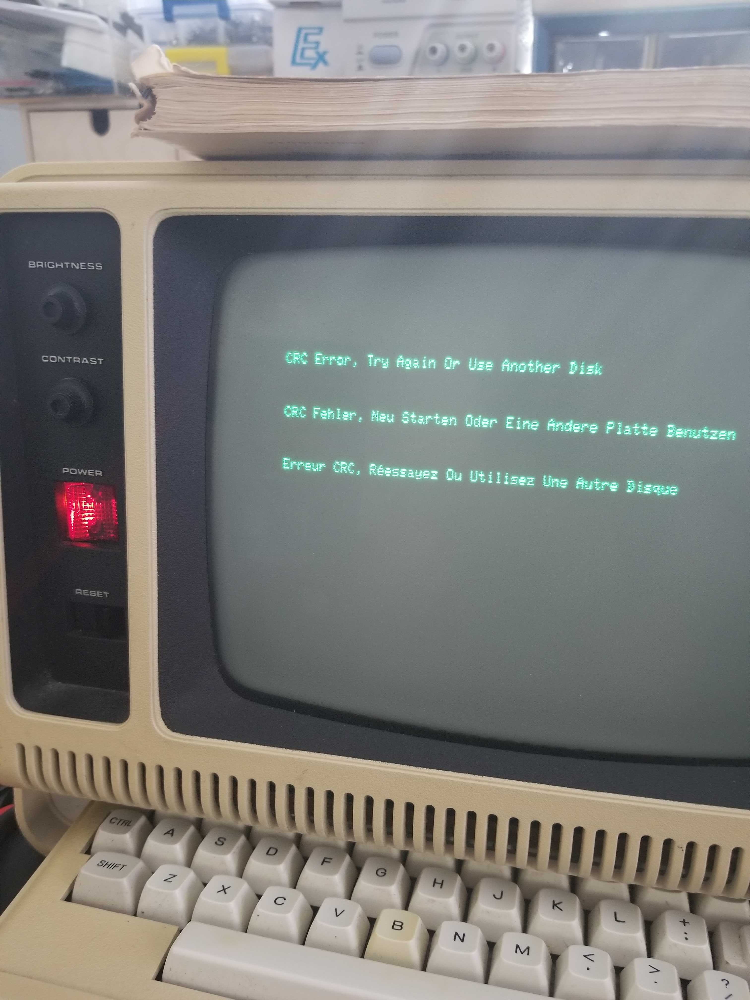

# TRS80-4P

The original goal of this project was to receive data from my TRS-80 4P's RS232 interface and send a text message after data was received.

It involved either writing Z80 assembly or embedding machine code into BASIC.
As soon as I started actually making some ground one night I went to sleep.
The next morning I woke up horrified when I tried to boot up the model 4P.

It either had faulty RAM or my preboot floppy corrupted.
Either way, this project idea was killed just like that; I didn't have any time left to try repairing.

## References
* [TRS-80 Model 4P service manual (1984)](https://archive.org/details/TRS80Model4PServiceManual/mode/2up)
* [TRS-80 Model III Operation and BASIC Language Reference Manual (1980)](http://www.1000bit.it/support/manuali/trs/Model%203%20Operation%20and%20BASIC%20Language%20Ref%20Man%20%281980%29%28Tandy%29%5Ba2%5D.pdf)
* [TRS-80 Assembly Language Programming (1980)](https://archive.org/details/TRS-80_Assembly_Language_Programming_1980_Radio_Shack)
* [NewDos 2.0](http://www.trs-80.com/wordpress/dos-newdos80/newdos80-v2-0-reference-one-page/)
